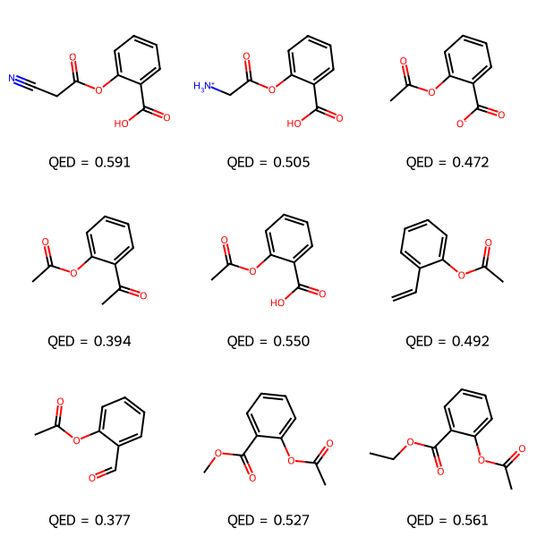

# GenMask

Generate novel molecule and protein analogues by masking part of a sequence and
unmasking it with a Hugging Face masked-language model.

Given a SMILES string or an amino-acid sequence, GenMask masks a fraction of its
tokens/residues, then fills them back in most-confident-position first, keeping every
candidate whose probability clears a cutoff (not just the single best guess). Repeating
this with different masking patterns (start, end, and several random draws) produces a
diverse set of plausible analogues in one run.

## Contents

- **Small molecules** — mask/unmask SMILES tokens with a BERT-style model, score
  results with QED (drug-likeness) and Tanimoto similarity to the parent molecule.
- **Proteins** — mask/unmask residues with an ESM2 model, score results with percent
  sequence identity to the parent. Sequences can come from a raw string or be pulled
  directly from a PDB entry and chain.

## Setup

```bash
python -m venv .venv
source .venv/bin/activate
pip install -r requirements.txt

export HF_TOKEN=your_huggingface_token   # required for gated/private HF models
```

## Usage

### Small molecules (SMILES)

```bash
python code/gen_mask_cli.py --smiles "CC(=O)Oc1ccccc1C(=O)O"
python code/gen_mask_cli.py --csv molecules.csv
```

The CSV mode looks for a `smiles`/`SMILES`/`Smiles` column (case-insensitive).

| Flag | Default | Description |
|---|---|---|
| `--smiles` | — | A single SMILES string |
| `--csv` | — | CSV file with a SMILES column |
| `--percent` | `0.10` | Fraction of tokens masked per pass |
| `--model` | `cafierom/bert-base-cased-ChemTok-ZN250K-V1` | HF model name |
| `--out` | `outputs/results.csv` | Output CSV path |
| `--no-image` | off | Skip saving a grid-image PNG per input molecule |
| `--no-tanimoto` | off | Skip the `tanimoto_to_parent` similarity column |

Output columns: `input_smiles`, `analogue_smiles`, `entropy`, `qed`, `tanimoto_to_parent`.

### Proteins

```bash
python code/protein_mask_cli.py --sequence "MKTAYIAKQRQISFVKSHFSRQLEERLGLIEV..."
python code/protein_mask_cli.py --pdb 4ZGM --chain B
python code/protein_mask_cli.py --csv sequences.csv
```

The CSV mode looks for a `sequence`/`Sequence`/`SEQUENCE` column (case-insensitive).

| Flag | Default | Description |
|---|---|---|
| `--sequence` | — | A single amino-acid sequence |
| `--csv` | — | CSV file with a sequence column |
| `--pdb` | — | PDB ID to fetch a chain's sequence from (use with `--chain`) |
| `--chain` | — | Chain letter to extract, e.g. `B` (required with `--pdb`) |
| `--percent` | `0.10` | Fraction of residues masked per pass |
| `--prob-cutoff` | `0.05` | Minimum candidate probability to keep a beam |
| `--model` | `facebook/esm2_t12_35M_UR50D` | HF ESM checkpoint |
| `--out` | `outputs/protein_results.csv` | Output CSV path |

Output columns: `input_sequence`, `generated_sequence`, `entropy`, `percent_identity_to_parent`.

### Three-letter amino acid codes

`gen_mask` and `gen_from_multimask` expect single-letter sequences. If your sequence
is in three-letter form, convert it with the helpers in `CafChemProteinMaskEmbed.py`
(not wired into the CLI — use them in a script or interpreter):

```python
import CafChemProteinMaskEmbed as pm

seq = pm.three_letter_seq_to_one("Ala-Gly-Leu")   # -> "AGL"
# ... pass seq to pm.gen_mask(seq, percent_masked) ...
three_letter = pm.one_letter_seq_to_three("AGL")  # -> "ALA-GLY-LEU"
```

`three_letter_seq_to_one` accepts codes separated by whitespace, hyphens,
underscores, commas, or slashes, or run together with no separator (e.g.
`"AlaGlyLeu"`) as long as the total length is a multiple of 3.

## Examples

### Small molecules

```bash
python code/gen_mask_cli.py --smiles "CC(=O)Oc1ccccc1C(=O)O"
```

```
First masking generated 2 SMILES
Last masking generated 6 SMILES
Random masking generated 2 SMILES
Random masking generated 0 SMILES
Random masking generated 0 SMILES
Random masking generated 2 SMILES
Total SMILES generated: 12
Total unique SMILES generated: 9

analogue 1: N#CCC(=O)Oc1ccccc1C(=O)O with QED: 0.591
analogue 2: [NH3+]CC(=O)Oc1ccccc1C(=O)O with QED: 0.505
analogue 3: CC(=O)Oc1ccccc1C(=O)[O-] with QED: 0.472
analogue 4: CC(=O)Oc1ccccc1C(C)=O with QED: 0.394
analogue 5: CC(=O)Oc1ccccc1C(=O)O with QED: 0.550
analogue 6: C=Cc1ccccc1OC(C)=O with QED: 0.492
analogue 7: CC(=O)Oc1ccccc1C=O with QED: 0.377
analogue 8: COC(=O)c1ccccc1OC(C)=O with QED: 0.527
analogue 9: CCOC(=O)c1ccccc1OC(C)=O with QED: 0.561

Saved image: outputs/molecule_0.png
Saved 9 analogues to outputs/results.csv
```

`outputs/molecule_0.png`:



`outputs/results.csv`:

| analogue_smiles | entropy | qed | tanimoto_to_parent |
|---|---|---|---|
| N#CCC(=O)Oc1ccccc1C(=O)O | 0.274 | 0.591 | 0.652 |
| [NH3+]CC(=O)Oc1ccccc1C(=O)O | 0.361 | 0.505 | 0.698 |
| CC(=O)Oc1ccccc1C(=O)[O-] | 0.506 | 0.472 | 0.750 |
| CC(=O)Oc1ccccc1C(C)=O | 0.513 | 0.394 | 0.750 |
| C=Cc1ccccc1OC(C)=O | 0.560 | 0.492 | 0.545 |
| CC(=O)Oc1ccccc1C=O | 0.513 | 0.377 | 0.581 |
| COC(=O)c1ccccc1OC(C)=O | 0.145 | 0.527 | 0.698 |
| CCOC(=O)c1ccccc1OC(C)=O | 0.289 | 0.561 | 0.652 |

### Proteins

```bash
python code/protein_mask_cli.py --pdb 4ZGM --chain B --percent 0.10
```

```
Fetched 4ZGM chain B: HXEGTFTSDVSSYLEGQAAKEFIAWLVRGRG
First masking generated 9 sequences
Last masking generated 81 sequences
Random masking generated 27 sequences
Random masking generated 9 sequences
Random masking generated 27 sequences
Random masking generated 9 sequences
Total sequences generated: 162

analogue 1: MGSGTFTSDVSSYLEGQAAKEFIAWLVRGRG with 90.3% identity to parent
analogue 2: MLSGTFTSDVSSYLEGQAAKEFIAWLVRGRG with 90.3% identity to parent
analogue 3: MGAGTFTSDVSSYLEGQAAKEFIAWLVRGRG with 90.3% identity to parent
...

Saved 162 analogues to outputs/protein_results.csv
```

## Repository layout

```
code/       library modules and CLI entry points
outputs/    generated CSVs and images (not tracked in git)
docs/       README assets (example images)
archive/    earlier exploratory notebooks
```

## Models

- **SMILES**: `cafierom/bert-base-cased-ChemTok-ZN250K-V1`, a BERT model trained on
  tokenized SMILES strings.
- **Proteins**: any Hugging Face ESM2 checkpoint (e.g. `facebook/esm2_t12_35M_UR50D`
  through `facebook/esm2_t33_650M_UR50D`) — larger checkpoints give better predictions
  at the cost of slower runs and bigger downloads.
